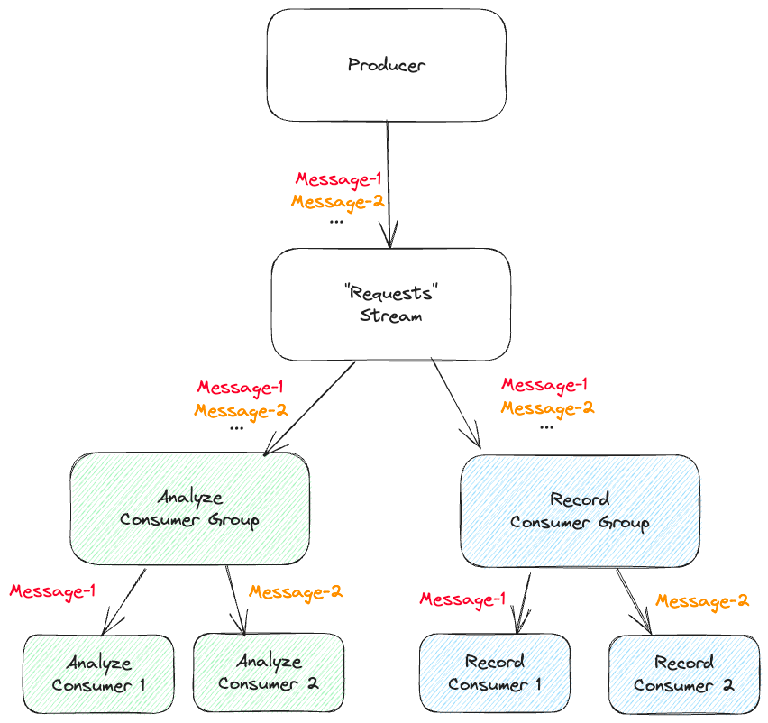

# go-redis-streams
Go implementation of writing and reading from Redis Streams using multiple Consumer groups.



**How to run**

You need to have Redis running locally and the easiest way to do this is to spin up a Docker container using this command:
```shell
docker compose up
```

**Inspecting the streams**
To view the stream, consumer groups and consumers, visit `http://localhost:8001/` in your browser.